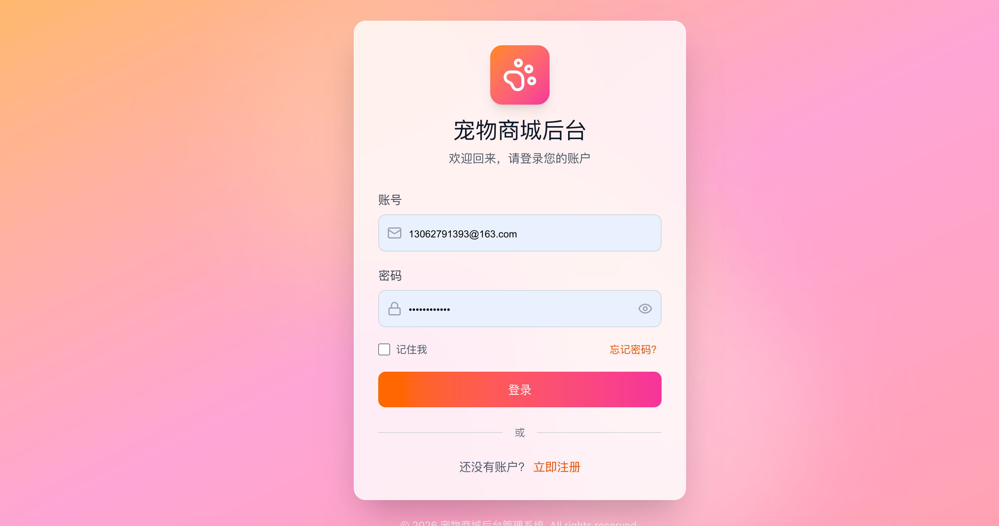
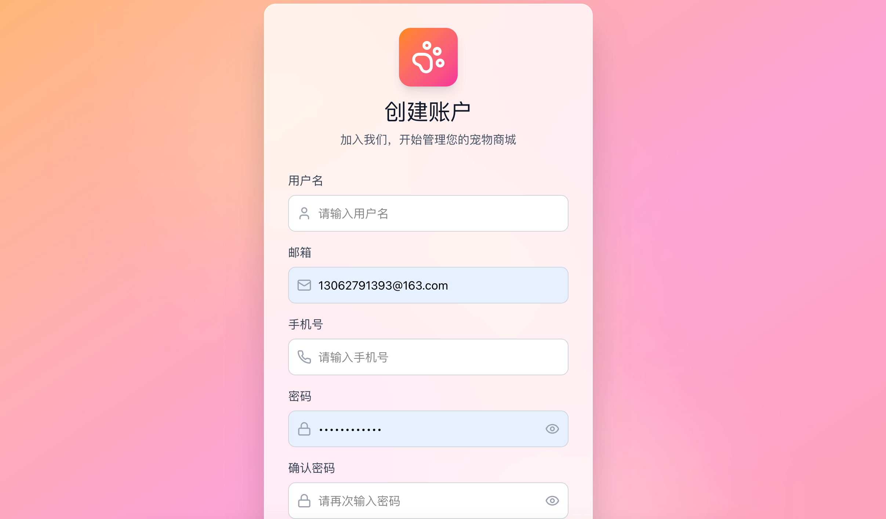
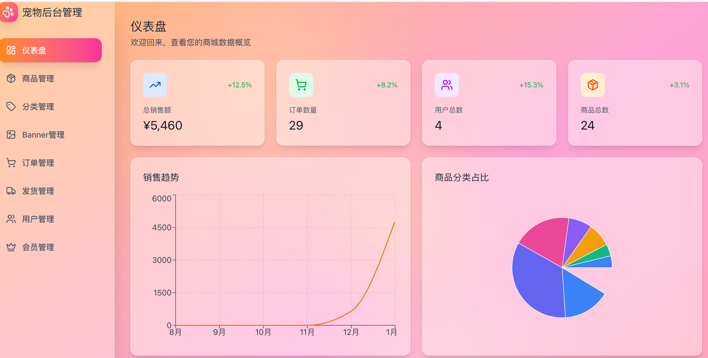

# 🐾 宠物店管理系统后端 (Pet Store Admin Backend)

基于 **FastAPI** 构建的高性能宠物店管理系统后台 API。支持商品全生命周期管理、订单自动化处理、会员权益系统及实时物流追踪。

---

## 🚀 技术栈

| 维度 | 技术选型 |
| :--- | :--- |
| **核心框架** | [FastAPI](https://fastapi.tiangolo.com/) |
| **ORM** | [SQLAlchemy](https://www.sqlalchemy.org/) |
| **数据库驱动** | [PyMySQL](https://github.com/PyMySQL/PyMySQL) |
| **数据验证** | [Pydantic v2](https://docs.pydantic.dev/) |
| **安全认证** | [Passlib](https://passlib.readthedocs.io/) (Bcrypt) + JWT |
| **异步服务器** | [Uvicorn](https://www.uvicorn.org/) |

---

## 🛠️ 快速开始

### 1. 环境准备
*   Python 3.10+
*   MySQL 8.0+

### 2. 安装与配置
```bash
# 进入后端目录
cd backend

# 创建并激活虚拟环境
python3 -m venv venv
source venv/bin/activate  # Windows 使用: venv\Scripts\activate

# 安装依赖
pip install -r requirements.txt
```

### 3. 数据初始化
运行以下脚本以快速构建基础数据：
```bash
python seed.py                 # 注入基础业务数据
python seed_shipping.py        # 注入物流模拟数据
python create_default_admin.py   # 创建默认管理员账号
python update_db_vip.py        # 初始化会员等级体系
```

### 4. 启动服务
```bash
uvicorn app.main:app --reload
```
💡 接口文档地址：[http://localhost:8000/docs](http://localhost:8000/docs)

---

## 📂 目录结构

```text
backend/
├── app/
│   ├── main.py          # 程序主入口
│   ├── database.py      # 数据库连接与 Session 配置
│   ├── models.py        # SQLAlchemy 数据库模型 (User, Product, Order, etc.)
│   ├── schemas.py       # Pydantic 数据转换与验证模型
│   └── routers/         # 业务路由模块 (admin, products, orders, shipping, vip)
├── uploads/             # 静态资源及图片上传目录
├── test/                # 单元测试与集成测试脚本
├── seed_*.py            # 数据库初始化/种子脚本
└── requirements.txt     # 项目依赖配置文件
```

---

## 🔐 核心功能模块

*   **📦 商品管理**: 支持商品分类、库存预警、多图上传及价格策略。
*   **🧾 订单处理**: 完整的下单流程、支付状态流转及发票管理。
*   **🚚 物流系统**: 实时对接物流状态，支持运单号追踪与发货确认。
*   **💎 会员体系 (VIP)**: 阶梯式会员等级、积分累积、消费抵扣及专属优惠。
*   **📊 数据分析**: 销售额统计、热销商品排行及用户增长维度分析。

---

## 🖼️ 项目预览

|  |  |  |

---
Made with 🐍 and FastAPI.